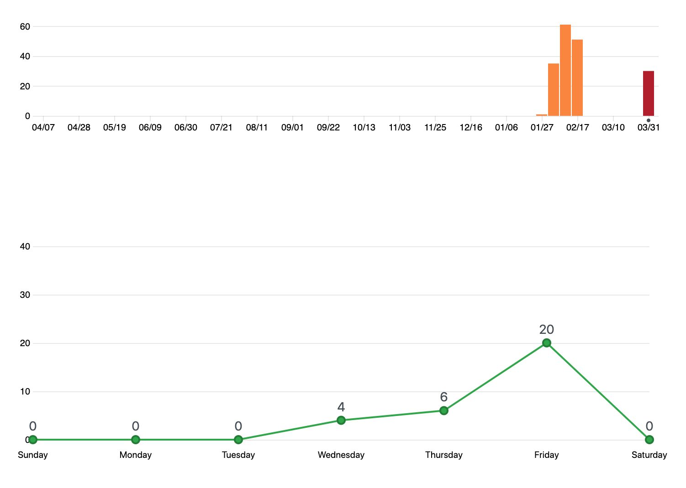
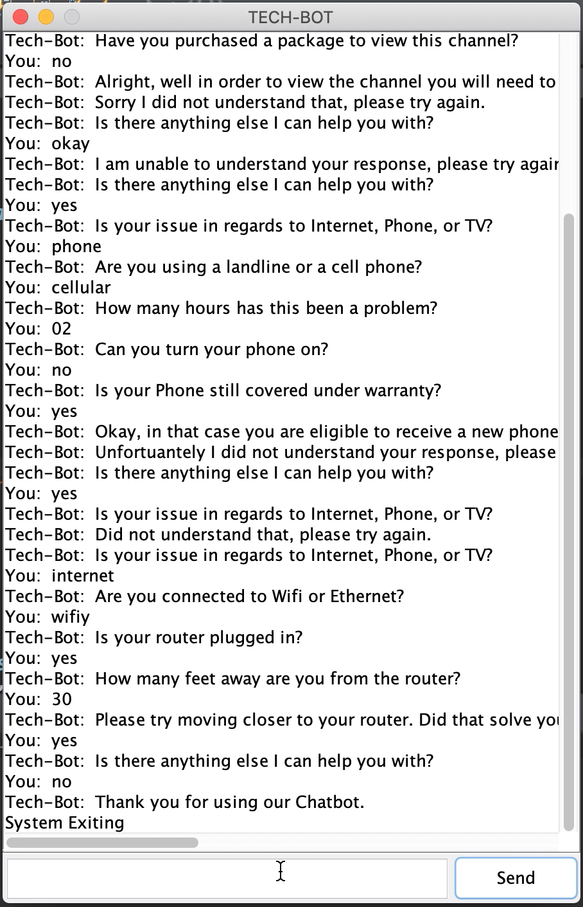
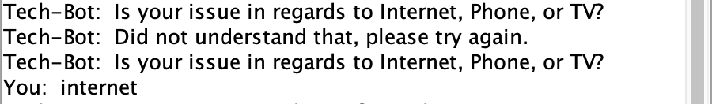
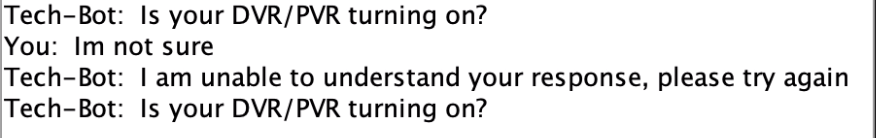
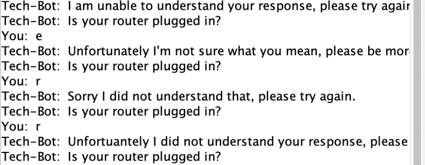

# COSC310-Assignment3 - Damyn Filipuzzi

The purpose of the program we created is to assist users in solving their technology problems. This chatbot is similar to ones you would see on websites such as TELUS where the chatbot leads the user through a series of questions in order to attempt to solve the users tech problems. In order to run the program in eclipse you will need to complete the following steps:

1.	Download and install Eclipse.
2.	In your browser, open the URL for the github repository , click accept, click the URL then click Clone and copy the URL
3.	In Eclipse, File - import - git - projects from Git - clone URI then enter the URI.

To run the chatbot you will need to run the class "Interface.java" located in the Gui folder as a java application.

The Data Flow Diagram above shows the level 0 stage in the major subsystems and their interactions with the user along with the logger. The user input is handled throught the Interface then the main process returns the output based on the users input. And finally once the user has finished interacting with the main process, the program writes out the conversation to the log files.

The Data Flow Diagram above shows the level 1 stage of the program and the interactions with the user and the processes which occur. The diagram shows the user input recieved by the UserInput process, after which it is passed into the Run which passes the input to questions to determine the next question. The Decision Matrix then selects the next question based and returns it to run where it branches the output (next question) to the user. The StackHandler recieves the user input and bot output and pushes it to the conversation log, and as well it pushes the question file paths containing the questions to the File log path.

# Commits Graph

Note: The I started working on this assignment from the initial repository which is why the graphs appear skewed.
# Sample Output
The image below shows over 30 turns of dialouge between the user and the Bot

The image below shows a error which was introduced with the implementation of the Gui. This problem occurs because previously a scanner was used to to get the user input, which meant that the program would wait for the user to input something then it would continue on with the code. In order to get the program to work I had to change the logic, and in doing so introduced a new bug, where the bot only would wait for 4 seconds before trying to read the users #input.

The image below shows an error in which the bot doesn't understand an ambiguous response from the user, the bot handles this by asking the user to ask rephrase their input. 

# API
- StackHandler to log the conversation, and file path
- TextFile Creator, which can be used to create new branches for the conversation
- Bot Output/Input to the bot
- Tree/Decision matrix class to build question files for the bot to decide what question to ask next
- Basic SpellChecker

# Features Implemented Since Assignment 2
 - Graphical User Interface
 - Multiple responses to misunderstood user input
 - Added additional bot dialogue branch (TV)
 - SpellChecker
 
### Graphical User Interface
The graphical user interface allows the user to interact with the bot in an application view. 

### Multiple Responses to misunderstood user input
This feature gives the user the feeling that they're are talking to another person rather than a computer programmed, that just outputs the same generic responses over and over again.

### Added additional bot dialogue branch (TV)

### SpellChecker
The spell checker feature corrects any inproper or slight spelling errors the user can submitting their response. In the picture below the bot is expecting the input of "Cell" however the user enters "Cellular", the feature takes the users input and determines that they are reffering to "Cell" and outputs the proper follow up question.

