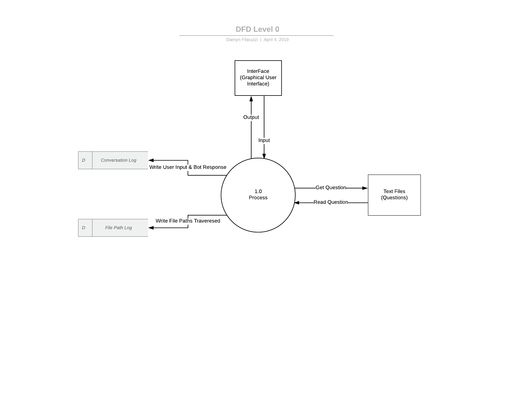
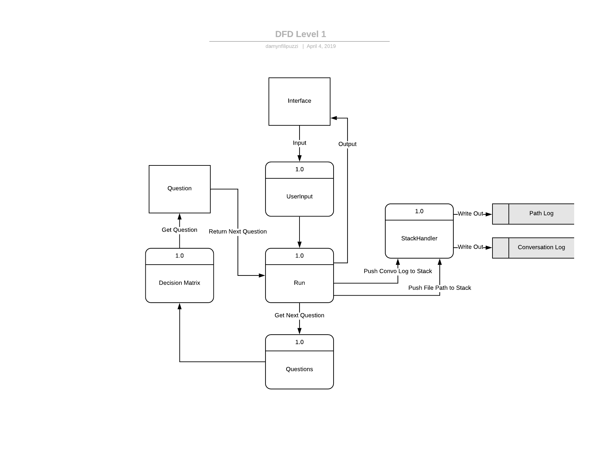

# COSC310-Assignment3-Damyn_Filipuzzi

The purpose of the program we created is to assist users in solving their technology problems. This chatbot is similar to ones you would see on websites such as TELUS where the chatbot leads the user through a series of questions in order to attempt to solve the users tech problems. In order to run the program in eclipse you will need to complete the following steps:

1.	Download and install Eclipse.
2.	In your browser, open the URL for the github repository , click accept, click the URL then click Clone and copy the URL
3.	In Eclipse, File - import - git - projects from Git - clone URI then enter the URI.

To run the chatbot you will need to run the class "Interface.java" located in the Gui folder as a java application.

# Features Implemented Since Assignment 2
 - Graphical User Interface
 - Multiple responses to misunderstood user input
 - Added additional bot dialogue branch (TV)

The Data Flow Diagram above shows the level 0 stage in the major subsystems and their interactions with the user along with the logger. The user input is handled throught the Interface then the main process returns the output based on the users input. And finally once the user has finished interacting with the main process, the program writes out the conversation to the log files.

The Data Flow Diagram above shows the level 1 stage of the program and the interactions with the user and the processes which occur. The diagram shows the user input recieved by the UserInput process, after which it is passed into the Run which passes the input to questions to determine the next question. The Decision Matrix then selects the next question based and returns it to run where it branches the output (next question) to the user. The StackHandler recieves the user input and bot output and pushes it to the conversation log, and as well it pushes the question file paths containing the questions to the File log path.
